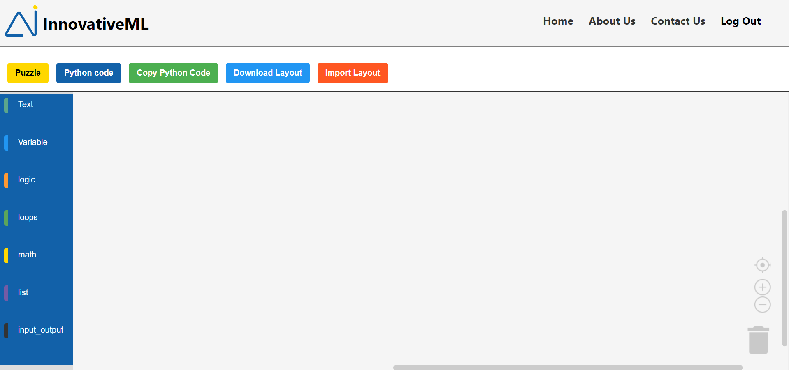
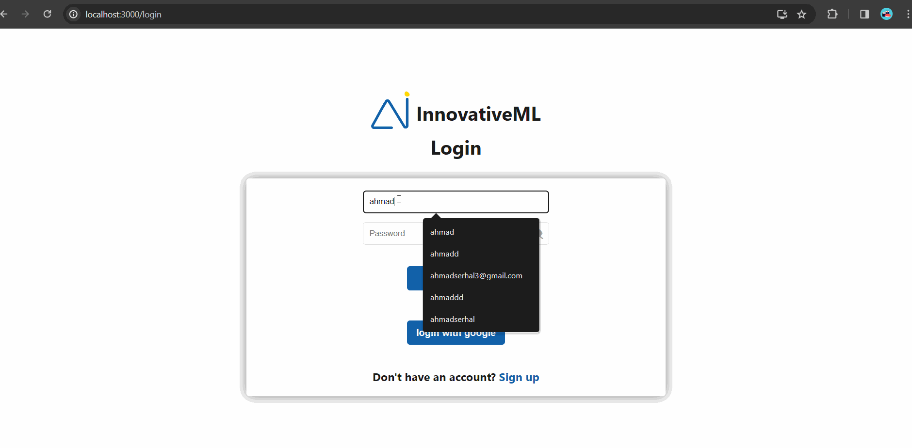
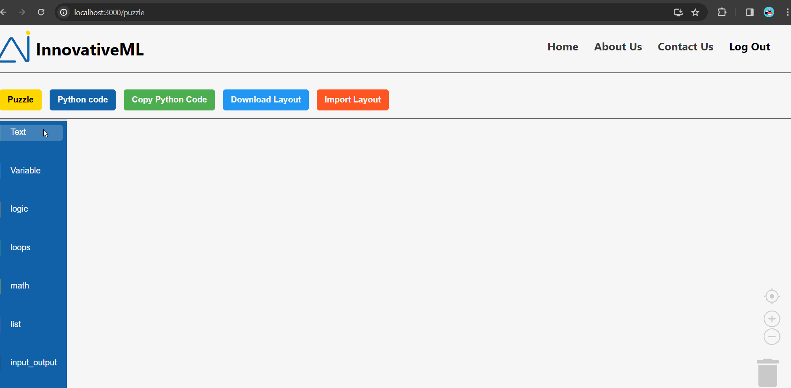
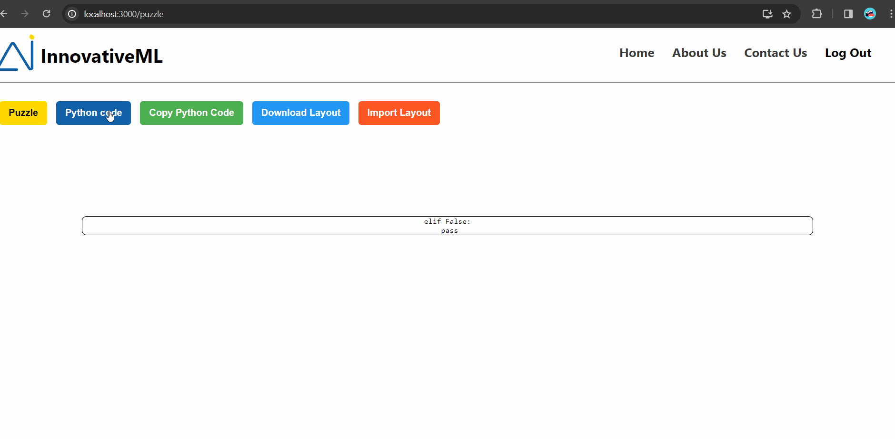

<br>
<!-- <br> -->

<!-- project philosophy -->


> InnovativeML is a brilliant website that teaches machine learning throught games like puzzle.

>InnovativeML aims to revolutionize the AI landscape, simplifying the machine learning journey through an intuitive platform. Users can seamlessly guide their learning with engaging puzzles. As fervent advocates of AI's transformative power, InnovativeML is committed to constant enhancement and updates. Embracing AI as the future, our user-friendly platform invites active participation, allowing users to shape and refine the future of machine learning through interactive and thought-provoking puzzles.
### User Stories

- As a user, I want the platform to regularly update its content and challenges, so I can stay informed about the latest developments in the field of machine learning.

- As a user, I want the platform to support multiple media types (text, images, and videos) for teaching machine learning, so I can choose the most suitable method for my learning style.

- As a user, I want to receive instant feedback on my puzzle-solving attempts, so I can understand how machine learning algorithms analyze my input.

<br>
<!-- <br> -->
<!-- Tech stacks -->


###  InnovativeML is built using the following technologies:

- This project leverages the React.js (https://reactjs.org/) which is a javascript library that allows for dynamic interfaces and reusabel ui components and is a versatile, cross-platform technology enabling a unified codebase for applications across mobile, desktop, and web platforms.
- This project utilizes MongoDB 🍃 (https://www.mongodb.com/), a powerful NoSQL database system. MongoDB facilitates the storage and retrieval of data in a flexible and scalable manner.
- The Backend is Empowered by Node.js 🚀 (https://nodejs.org/en). Efficient, versatile, and high-performing.

<br>
<!-- <br> -->

<!-- Prototyping -->


> InnovativeML was thoughtfully designed using wireframes and mockups, with a dedicated process of iteration to achieve the ideal layout. This approach ensures an effortless user experience and easy navigation 
  within the platform.

<!-- ### Wireframes
| Login screen  | Register screen |  Landing screen |
| ---| ---| ---|
|  |  |  | -->


| Home screen  | Puzzle | Contact Us |
| ---| ---| ---|
|  |  |  |

<br><br>

<!-- Implementation -->


<!-- > Using the wireframes and mockups as a guide, we implemented the Coffee Express app with the following features:

### User Screens (Mobile)
| Login screen  | Register screen | Landing screen | Loading screen |
| ---| ---| ---| ---|
|  |  |  |  |
| Home screen  | Menu Screen | Order Screen | Checkout Screen |
|  |  |  |  | -->

### Demo
| Google Authentication  | Project Preview |  Puzzle Workspace|
| ---| ---| ---|
|  |  |  |
| Python Conversion  | Export & Import  | 
|  |  | 
<br><br>


###  WS Integration Excellence: Unleashing Potential with Seamless Deployment:
- This project strategically employs AWS deployment strategies for the seamless incorporation and deployment of    natural language processing models. Prioritizing scalability, reliability, and optimal performance, our aim is to ensure applications powered by these models deliver robust and responsive solutions across diverse use cases. Experience the synergy of streamlined implementation and AWS capabilities for unparalleled efficiency in unleashing the full potential of technology.


<!-- How to run -->


> To set up InnovativeML locally, follow these steps:

### Installation

_To run the InnovativeML project locally, follow these steps:

1. Clone the repo
   ```sh
   git clone https://github.com/AhmadSerhall/innovativeML
   ```
2. Navigate to Frontend folder
   ```sh
   cd innovativeML/frontend
   ```
3. Install the most import NPM dependencies
   ```sh
   npm install react axios blockly react-router-dom
   ```
### Explication of the frontend dependencies
- React which is the library that this project have been created with , it allows for dynamic interfaces and reusable UI components
-  Axios simplifies making HTTP requests and handling responses, providing a clean and intuitive interface for sending asynchronous requests to a server.
- Blockly is a visual programming language developed by Google. It allows users to create programs by stacking visual blocks representing code logic. Blockly is often used for educational purposes and creating visual programming interfaces and is the main idea of this project
- React Router Dom is a library for handling navigation and routing in React applications.It allows developers to manage the UI state and URL changes seamlessly in a single-page application.

4. Start Frontend Development server
   ```sh
   npm start
   ```
5. Navigate to the backend folder
  ```sh
   cd ../backend
   ```
6. Install the most important Backend dependencies
  ```sh
   npm install express nodemon mongoose passport
   ```
### Explication of the backend dependencies
- Express is a  flexible Node.js web application framework that helps  build robust and scalable web applications and APIs. It provides a set of features for routing, middleware management, and handling HTTP requests and responses, making it a popular choice for creating server-side applications.
- Nodemon is a utility tool for Node.js that  automatically restarts the server when changes are detected. It enhances the development workflow by eliminating the need for manual server restarts, making it easier for developers to test and iterate on their code.
- Mongoose is a library for MongoDB and Node.js. It simplifies interactions with MongoDB by providing a straightforward solution for modeling application data. Mongoose allows developers to define data models, perform CRUD operations, and many other useful things
- Passport is a middleware for Node.js-based applications that facilitates user authentication. It support various authentication strategies, it is commonly used for integrating third-party authentication providers, such as social media and google logins enhancing security and user experience.

7. Set up mongoDB
- Ensure you have mongoDB installed on your machine
- Create mongoDB database for the project
8. Configure Backend environment
- In the backend directory, create a `.env` file.
- Add the following configuration with your MongoDB connection URI:
```sh
   MONGODB_URI=your_mongodb_connection_uri
   ```
9. Start your Backend server
```sh
   node index.js
   ```

> Now, you should be able to access the InnovativeML project locally by navigating to http://localhost:3000 in your web browser. Explore its features and innovations!
