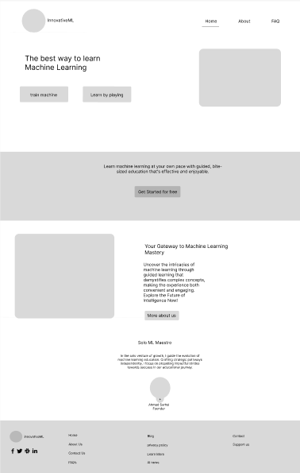
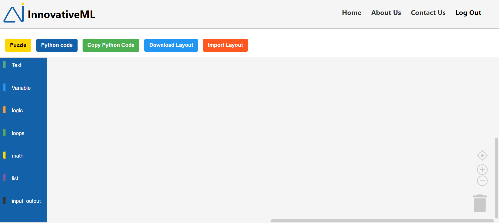
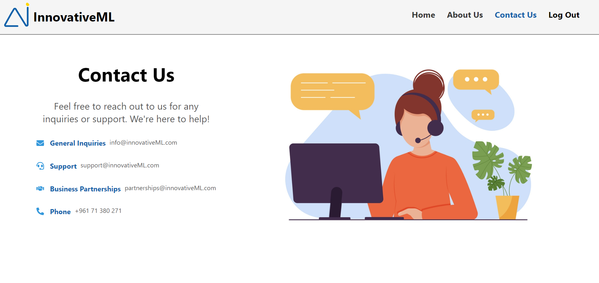

<br>
<!-- <br> -->

<!-- project philosophy -->


> InnovativeML is a brilliant website that teaches machine learning throught games like puzzle.

>InnovativeML aims to revolutionize the AI landscape, simplifying the machine learning journey through an intuitive platform. Users can seamlessly guide their learning with engaging puzzles. As fervent advocates of AI's transformative power, InnovativeML is committed to constant enhancement and updates. Embracing AI as the future, our user-friendly platform invites active participation, allowing users to shape and refine the future of machine learning through interactive and thought-provoking puzzles.
### User Stories

- As a user, I want the platform to regularly update its content and challenges, so I can stay informed about the latest developments in the field of machine learning.

- As a user, I want the platform to support multiple media types (text, images, and videos) for teaching machine learning, so I can choose the most suitable method for my learning style.

- As a user, I want to receive instant feedback on my puzzle-solving attempts, so I can understand how machine learning algorithms analyze my input.

- As a beginner, I want the option to practice with simplified machine learning puzzles that gradually introduce key concepts, helping me learn at my own pace.

- As a beginner, I want access to tutorials and educational resources, so I can build a solid foundation in machine learning principles.

- As a beginner, I want the puzzles to include visual aids or interactive elements that simplify complex concepts, making it easier for me to comprehend machine learning principles.

- As an enthusiast, I want to track my progress and achievements, so I can monitor my learning journey and set personal goals.

- As an enthusiast, I want to explore real-world applications of machine learning by solving puzzles that simulate practical scenarios, allowing me to see the direct impact of my learning on solving actual   
  problems.

- As an enthusiast, I want a visually engaging and interactive platform that makes learning machine learning through puzzles an enjoyable and immersive experience, keeping me motivated and engaged throughout the 
  journey.

<br>
<!-- <br> -->
<!-- Tech stacks -->


###  InnovativeML is built using the following technologies:

- This project leverages the React.js (https://reactjs.org/) which is a javascript library that allows for dynamic interfaces and reusabel ui components and is a versatile, cross-platform technology enabling a unified codebase for applications across mobile, desktop, and web platforms.
- This project utilizes MongoDB 🍃 (https://www.mongodb.com/), a powerful NoSQL database system. MongoDB facilitates the storage and retrieval of data in a flexible and scalable manner.
- The Backend is Empowered by Node.js 🚀 (https://nodejs.org/en). Efficient, versatile, and high-performing.

<br>
<!-- <br> -->

<!-- Prototyping -->


> InnovativeML was thoughtfully designed using wireframes and mockups, with a dedicated process of iteration to achieve the ideal layout. This approach ensures an effortless user experience and easy navigation 
  within the platform.

<!-- ### Wireframes
| Login screen  | Register screen |  Landing screen |
| ---| ---| ---|
|  |  |  | -->

### Preview
| Home screen  | Puzzle | Contact Us |
| ---| ---| ---|
|  |  |  |

<br><br>

<!-- Implementation -->


<!-- > Using the wireframes and mockups as a guide, we implemented the Coffee Express app with the following features:

### User Screens (Mobile)
| Login screen  | Register screen | Landing screen | Loading screen |
| ---| ---| ---| ---|
|  |  |  |  |
| Home screen  | Menu Screen | Order Screen | Checkout Screen |
|  |  |  |  | -->

### Admin Screens (Web)
| Login screen  | Register screen |  Landing screen |
| ---| ---| ---|
|  |  |  |
| Home screen  | Menu Screen | Order Screen |
|  |  |  |

<br><br>


<!-- How to run -->


> To set up Coffee Express locally, follow these steps:

### Prerequisites

This is an example of how to list things you need to use the software and how to install them.
* npm
  ```sh
  npm install npm@latest -g
  ```

### Installation

_Below is an example of how you can instruct your audience on installing and setting up your app. This template doesn't rely on any external dependencies or services._

1. Get a free API Key at [https://example.com](https://example.com)
2. Clone the repo
   ```sh
   git clone https://github.com/your_username_/Project-Name.git
   ```
3. Install NPM packages
   ```sh
   npm install
   ```
4. Enter your API in `config.js`
   ```js
   const API_KEY = 'ENTER YOUR API';
   ```

Now, you should be able to run Coffee Express locally and explore its features.
