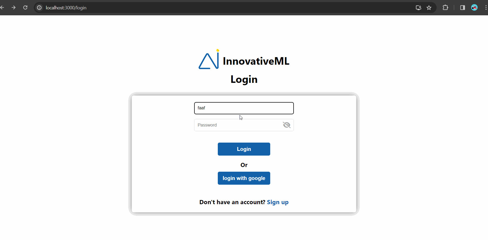

<br>
<!-- <br> -->

<!-- project philosophy -->


> InnovativeML is a dynamic platform that revolutionizes education by integrating interactive puzzles. With its user-friendly design, the platform encourages active engagement, enabling users to delve into the complexities of the subject in an enjoyable and accessible manner. The seamless navigation facilitated by the user-friendly design fosters a dynamic environment, ensuring an enriched learning experience for all.

### User Stories

- As a user, i want the platform to regularly update its content and challenges, so I can stay informed about the latest developments in the field of machine learning.

- As a user , i want to easily navigate through the InnovativeML platform, So that I can seamlessly access interactive puzzles.

- As a user , i want to engage with fun and interactive puzzles on InnovativeML, So that I can grasp machine learning concepts in an entertaining way.

<br>
<!-- <br> -->
<!-- Tech stacks -->


###  InnovativeML is built using the following technologies:

- This project leverages the [React.js](https://reactjs.org/)
 which is a javascript library that allows for dynamic interfaces and reusabel ui components and is a versatile, cross-platform technology enabling a unified codebase for applications across mobile, desktop, and web platforms.
- This project utilizes [MongoDB 🍃](https://www.mongodb.com/), a powerful NoSQL database system. MongoDB facilitates the storage and retrieval of data in a flexible and scalable manner.
- The Backend is Empowered by [Node.js🚀](https://nodejs.org/en). Efficient, versatile, and high-performing.

<br>
<!-- <br> -->

<!-- Prototyping -->


> InnovativeML was thoughtfully designed using wireframes, with a dedicated process of iteration to achieve the ideal layout. This approach ensures an effortless user experience and easy navigation 
  within the platform. Here is the [figma](https://www.figma.com/file/ekKPE7a5FD487XY2dVlEGq/final-project?type=design&node-id=0-1&mode=design&t=V2El9MHaW0zmCemw-0) file for this project


| Sign Up   | Home | Puzzle |
| ---| ---| ---|
|  |  |  |
| About | Benefits| Contact|
|  |  |  |


<br><br>

<!-- Implementation -->


<!-- ### Demo
| Google Authentication  | Project Preview |  Puzzle Workspace|
| ---| ---| ---|
|  |  |  |
| Python Conversion  | Export & Import  | 
|  |  | 
<br><br> -->

### Demo
| Google Authentication  | Project Preview |  Puzzle Workspace|
| ---| ---| ---|
|  |  |  |
| Python Conversion  | Export & Import  | 
|  |  | 
<br><br>


- This project strategically utilizes AWS EC2 instance deployment strategies to seamlessly integrate and deploy natural language processing models. Here's how its done:
```sh
   sudo yum install -y gcc-c++ make
curl -sL https://rpm.nodesource.com/setup_21.x | sudo -E bash -
sudo yum install -y nodejs
sudo yum install -y git
sudo vim /etc/systemd/system/innovativeML.service
    [Unit]
  	Description=innovativeML
  	After=multi-user.target

  	[Service]
  	ExecStart=/usr/bin/node /home/ec2-user/innovativeML/backend/index.js
  	Restart=always
  	RestartSec=10
    StandardOutput=syslog
  	StandardError=syslog
  	SyslogIdentifier=innovativeML
  	User=ec2-user
  	EnvironmentFile=/home/ec2-user/innovativeML/backend/.env

      [Install]
      WantedBy=multi-user.target

sudo systemctl enable innovativeML
sudo systemctl start innovativeML
   ``` 


<!-- Unit Testing -->


### To ensure the reliability of innovativeML , we must implement a suite of unit tests. Follow these steps to run these tests locally on your machine:

Frontend Tests
1. Navigate to the Frontend Directory:
  ```sh
   git innovativeML/frontend
   ``` 
2. Install frontend Test Depencies:
  ```sh
   git install
   ```
3. Run Frontend Unit Tests
  ```sh
   npm test
   ```
This will exectute the unit tests for the frontend, providing insights into the functionality and integrity of the user interface components
Backend Tests
1. Navigate to the Backend Directory
  ```sh
   git innovativeML/backend
   ``` 
2. Install Backend Test Dependencies
  ```sh
   npm install
   ``` 
3. Run Backend Unit Tests
  ```sh
   npm test
   ``` 
This will execute the unit tests for the backend, ensuring the reliability of the server-side logic.

### Testing Guidelines
- Make sure to have the necessary dependencies installed for both frontend and backend testing by running npm install in the respective directories.
- All tests should pass without errors or failures. If any issues are identified, please review the error messages and verify your installation and configuration.

> Running these unit tests will help ensure the robustness of the InnovativeML application, providing confidence in its functionality and reliability.


<!-- How to run -->


### Installation

> To run the InnovativeML project locally, follow these steps:

1. Clone the repo
   ```sh
   git clone https://github.com/AhmadSerhall/innovativeML
   ```
2. Navigate to Frontend folder
   ```sh
   cd innovativeML/frontend
   ```
3. Install the most import NPM dependencies
   ```sh
   npm install react axios blockly react-router-dom
   ```
### Explication of the frontend dependencies
- React which is the library that this project have been created with , it allows for dynamic interfaces and reusable UI components
-  Axios simplifies making HTTP requests and handling responses, providing a clean and intuitive interface for sending asynchronous requests to a server.
- Blockly is a visual programming language developed by Google. It allows users to create programs by stacking visual blocks representing code logic. Blockly is often used for educational purposes and creating visual programming interfaces and is the main idea of this project
- React Router Dom is a library for handling navigation and routing in React applications.It allows developers to manage the UI state and URL changes seamlessly in a single-page application.

4. Start Frontend Development server
   ```sh
   npm start
   ```
5. Navigate to the backend folder
  ```sh
   cd ../backend
   ```
6. Install the most important Backend dependencies
  ```sh
   npm install express nodemon mongoose passport
   ```
### Explication of the backend dependencies
- Express is a  flexible Node.js web application framework that helps  build robust and scalable web applications and APIs. It provides a set of features for routing, middleware management, and handling HTTP requests and responses, making it a popular choice for creating server-side applications.
- Nodemon is a utility tool for Node.js that  automatically restarts the server when changes are detected. It enhances the development workflow by eliminating the need for manual server restarts, making it easier for developers to test and iterate on their code.
- Mongoose is a library for MongoDB and Node.js. It simplifies interactions with MongoDB by providing a straightforward solution for modeling application data. Mongoose allows developers to define data models, perform CRUD operations, and many other useful things
- Passport is a middleware for Node.js-based applications that facilitates user authentication. It support various authentication strategies, it is commonly used for integrating third-party authentication providers, such as social media and google logins enhancing security and user experience.

7. Set up mongoDB
  - Ensure you have mongoDB installed on your machine
  - Create mongoDB database for the project
8. Configure Backend environment
  - In the backend directory, create a `.env` file.
  - Add the following configuration with your MongoDB connection URI:
```sh
   MONGODB_URI=your_mongodb_connection_uri
   ```
9. Start your Backend server
```sh
   node index.js
   ```

> Now, you should be able to access the InnovativeML project locally by navigating to http://localhost:3000 in your web browser. Explore its features and innovations!
